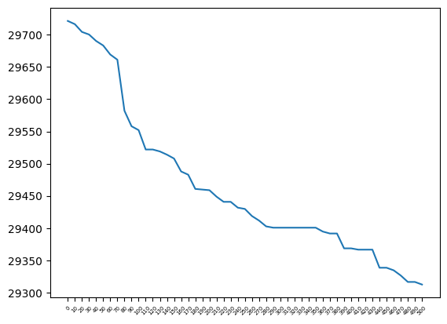

<h1>IMDB NLP Task:</h1>


<h2>question 1:</h2>

<h3>Overview</h3>
The system takes in a movie plot summary and returns the predicted genres.
It utilizes a DistilBert model for multi-label classification.

<h3>Modeling</h3>
<h4>Base model</h4>
I have used DistilBert as my base model for the following reasons:

1. Bert and its derivatives are known as a good solution for text classification
2. Distillation models are lighter in size and speed

<h4>Training</h4>
I fine-tuned the model using a custom Hugging Face Trainer, implementing a key modification by incorporating class
weights.
These class weights were assigned two distinct values: 1 and 0.1. The rationale behind this approach stems from the fact
that the problem at hand involves multi-label classification.
My assumption is that users would find it satisfactory to receive only a subset of the predicted genres.

This adjustment primarily aimed to address the long-tail distribution of class frequencies.
To determine the optimal threshold, I conducted a thorough analysis, ultimately selecting 350 as the value.
This choice struck a balance between the maximal number of labels necessary for meaningful learning and the acceptable
loss of examples,
as depicted in the chart below.



Furthermore, I trained only the last 3 layers (and the classifier) to balance between having a
new task and having a small dataset (to avoid overfiting).

<h4>Inference</h4>
I developed a Flask service, specifically an ```app.py``` file,
which features a crucial endpoint at ```/predict_genre```. To utilize this endpoint,
you need to provide a dictionary as input.
The dictionary should include a key-value pair where the key is 'text',
and the corresponding value is the plot text.

<h4>Evaluation</h4>
Given the specific nature of the task, I made the decision that users would not expect more than three answers as output
(the maximum number can be adjusted in the ```genre_clf_train_config.yaml``` file).
As a result, all my evaluations and metrics are derived based on this limitation.

The metrics I calculated are as follows:

1. Jacard Index (Best result 0.29): This metric provides insights into the overall performance of the model across all
   true labels. It assesses the similarity between the predicted labels and the ground truth labels.

2. Percentage of Examples with at Least One True Label (Best result 0.88): This metric calculates the percentage of
   examples that received at least one correct label prediction. It helps gauge the model's ability to capture relevant
   labels for a significant portion of the dataset.

3. Classification Report per Label: This analysis focuses specifically on the most frequent labels. By examining the
   classification report for each label, we can gain valuable insights for error analysis and understand the model's
   performance on the most prevalent classes.

<h4>Usage</h4>

1. train and evaluate: ```clf_train.py``` , config - ```genre_clf_train_config.yaml```
2. serving: ```app.py ```(```/predict_genre```), config - ```genre_clf_predict_config.yaml```

<h2>question 2:</h2>

<h3>Overview</h3>
The system takes in a movie plot summary and returns 10 most similar movies.
It utilizes SentenceTransformer 'all-MiniLM-L6-v2' model for the embedding space and faiss for ANN.

<h3>Modeling</h3>
<h4>design</h4>
In my project, I used the all-MiniLM-L6-v2 model as the embedding space, driven by the following considerations:

1. User-Friendliness: The all-MiniLM-L6-v2 model was chosen for its ease of use, enabling seamless integration into the
   project without significant implementation complexities.

2. Compact Embedding Size: The model's smaller embedding size provides improved performance, contributing to optimized
   computational resources and efficient memory utilization. This characteristic is particularly advantageous when
   prioritizing speed and efficiency.

3. High Performance: The all-MiniLM-L6-v2 model has consistently demonstrated impressive results across various tasks
   and benchmarks, underscoring its effectiveness and reliability.

   However, it is essential to note that in a real-world scenario, I would fine-tune the model to tailor it specifically
   to the context and unique requirements of the task at hand. Additionally, I would explore alternative models capable
   of accommodating larger input sizes to enhance performance and adaptability.

To enhance the performance of the similarity search component, I utilized
the [Faiss](https://github.com/facebookresearch/faiss) package. Faiss is renowned for its capabilities in delivering
efficient and scalable solutions for similarity search tasks. By leveraging Faiss, I was able to leverage performance
enhancements and ensure a robust search experience.

Additionally, as per the request, I implemented a caching system to further optimize performance. The caching system
helps store and retrieve previously computed results, reducing redundant computations and improving response times.
<h4>Inference</h4>
I developed a Flask service, specifically an ```app.py``` file,
which features a crucial endpoint at ```/suggest```. To utilize this endpoint,
you need to provide a dictionary as input.
The dictionary should include a key-value pair where the key is 'text',
and the corresponding value is the plot text.

<h4>Evaluation</h4>
Given the available data, I determined that the most suitable approach to evaluate similarity would be by comparing the
predicted genres. To assess the similarity between results, I employed two metrics:

Mean Percentage of Common Genres (Best result 0.59): This metric calculates the average percentage of results (out of

10) that share at least one genre in common. It provides insights into the extent to which the predicted genres align
    among the results.

Mean Intersection over Union (IoU) of Genres (Best result 0.18): This metric measures the average IoU of genres across
the results. It quantifies the overlap or shared characteristics between the predicted genres, offering a deeper
understanding of the similarity between the results.

Additionally, I calculated the standard deviation to monitor the stability of the model. The standard deviation provides
a measure of the variability in the similarity metrics, allowing me to gauge the consistency and reliability of the
model's performance.

By utilizing these metrics and monitoring the standard deviation, I aimed to comprehensively assess the similarity
between results, ensure model stability, and gain insights into the performance characteristics of the genre prediction
task.

However, it is essential to note that in a real-world scenario, I would try to evaluate the model with two more methods:

1. Ask human labelers to label portion of my test set
2. Use a LM to rephrase the input and verify that the model will output the original input
   <h4>Usage</h4>
1. build new embedding and evaluate: ```movie_simalirity.py``` , config - ```similarity_config.yaml```
2. serving: ```app.py``` (```/suggest```), config - ```similarity_config.yaml```
